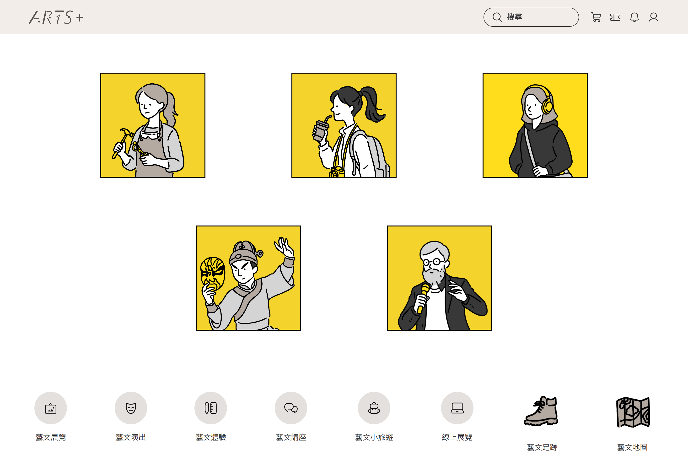

# Arts Plus 藝文活動平台

台灣藝文活動瀏覽與購票示範網站，使用 Vue 3 + Bootstrap 5 建構，
並實作三層設計 token 系統（Primitive / Semantic / Component）與 Bootstrap 變數覆寫。

🔗 [Live Demo](https://arts-plus-sigma.vercel.app/#/)
🎨 [Figma Prototype](https://figma.com/你的連結)
📁 [Behance](https://behance.net/你的連結)

## 技術堆疊

- Vue 3 + Vite
- Bootstrap 5（SCSS 變數覆寫 + CSS override）
- Pinia（狀態管理）
- Iconify (Mainly using Phosphor Icons)（圖示）

## 設計系統

採用三層 token 架構：
- Primitive：原始色票與基礎數值
- Semantic：語意化變數，對應使用情境
- Component：Bootstrap 變數 remap、樣式覆蓋

## 專案結構

src/
├── assets/
│   ├── images/                    # 活動圖片素材
│   └── styles/
│       ├── abstracts/             # 字體宣告、mixin 工具
│       ├── overrides/             # Bootstrap 元件樣式覆寫
│       ├── tokens/                # 設計 token（primitive / semantic / component）
│       ├── _animations.scss       # 全域動畫定義
│       └── main.scss              # 樣式入口，負責引入順序
├── components/
│   ├── common/                    # 版面框架元件（Layout、Navbar、Sidebar）
│   └── ui/                        # 可重用 UI 元件（Card、Overlay、NavTabs 等）
├── data/                          # 本地假資料（events、users）
├── router/                        # Vue Router 路由設定
├── stores/                        # Pinia 狀態管理（活動、使用者）
└── views/                         # 頁面元件（對應路由）

## 安裝與執行

git clone https://github.com/你的帳號/arts-plus.git
cd arts-plus
npm install
npm run dev

## Build

npm run build

## 團隊

| 姓名 | 負責頁面 | Github | Behance | 個人網站
|------|------|---------|
| 郭奕伶 | 首頁 | [wwyi0](https://github.com/wwyi0) | [Behance](https://behance.net/ac02a36c) |
| 高郁雯 | 活動編輯 | [wendyyyk](https://github.com/wendyyyk) |  | [個人網站](https://wendykao.framer.website/)
| 劉育全 | 活動搜尋 | [shermyliou](https://github.com/shermyliou) | [Behance](https://behance.net/shermyliou) |
| 蔡宜潔 | 活動介紹 | [metaphor1212](https://github.com/metaphor1212) | [Behance](https://www.behance.net/0f191faf) | 
| 吳盈瑩 | 藝文地圖 | [ShirlineWu](https://github.com/ShirlineWu) |  | [個人網站](https://wuyingying.my.canva.site/)